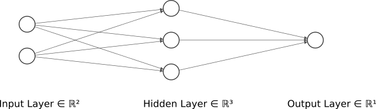

# Keras XOR
A simple XOR model with keras.



Graphic generated with [NN-SVG](http://alexlenail.me/NN-SVG/index.html) made by [Alex Lenail](http://alexlenail.me/).

## How to run
Install the required libraries with pip.
```sh
pip install -r requirements.txt
```

Run the python script.
```sh
python .
```

## Output
```
INPUTS
[[0 0]
 [0 1]
 [1 0]
 [1 1]]

OUTPUTS
[[0.00222052]
 [0.9753783 ]
 [0.97579545]
 [0.04735725]]
```
